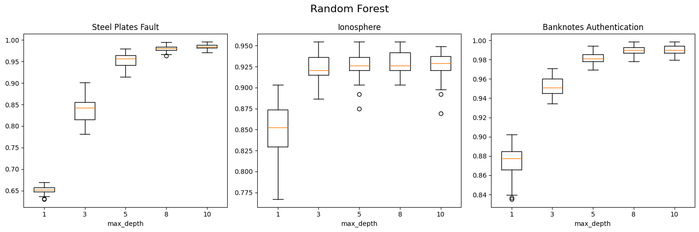

# COMP309 Assignment 1!

- 2-6 pages
- Min 11pt font size
- Due **2nd August**

## 1.3 Tasks

- [x] Make table of classifier boxplots
- [ ] Create tables (rows being classifiers, columns being datasets)
  - [ ] 1 table containg the **lowest mean value** of the test errors
  - [ ] 1 table showing best hyperparams for best test errors
- [ ] Paragraph analysing results (which model performed best/why, how sensitive each model is)

## 2.2 Tasks

- [ ] Test clusters

## Classifiers 

| **Classifier** | **Plot** |
| --- | --- |
| KNN |  |
| Gaussian NB |  |
| Decision Tree |  |
| Logistic Regression |  |
| Gradient Boosting |  |
| Random Forest |  |
| MLP |  |

### Analysis

- each cell contains the lowest mean value of the test errors

| **Classifier**      | Steel Plates | Ionosphere | Banknote auth |
| ------------------- | ------------ | ---------- | ------------- |
| KNN                 | 0.9767       | 0.8323     | 0.9973        |
| Gaussian NB         | 0.9822       | 0.8597     | 0.8384        |
| Decision Tree       | 0.6520       | 0.8183     | 0.8428        |
| Logistic Regression | 0.9989       | 0.8701     | 0.9714        |
| Gradient Boosting   | 1.0000       | 0.8668     | 0.9608        |
| Random Forest       | 0.6520       | 0.8483     | 0.8724        |
| MLP                 | 0.9984       | 0.8835     | 0.9687        |

| **Classifier**      | Steel Plates | Ionosphere | Banknote auth |
| ------------------- | ------------ | ---------- | ------------- |
| KNN                 | 5            | 5          | 5             |
| Gaussian NB         | 0.1          | 0.1        | 0.1           |
| Decision Tree       | 1            | 1          | 1             |
| Logistic Regression | 0.1          | 5.0        | 0.1           |
| Gradient Boosting   | 1            | 8          | 1             |
| Random Forest       | 1            | 1          | 1             |
| MLP                 | 1e-05        | 10.0       | 10.0          |

## Clustering

lorum epsumlorum epsumlorum epsumlorum epsumlorum epsumlorum epsumlorum epsumlorum epsumlorum epsumlorum epsumlorum epsumlorum epsumlorum epsumlorum epsumlorum epsumlorum epsumlorum epsumlorum epsumlorum epsumlorum epsumlorum epsumlorum epsumlorum epsumlorum epsumlorum epsumlorum epsumlorum epsumlorum epsumlorum epsumlorum epsumlorum epsumlorum epsumlorum epsumlorum epsumlorum epsumlorum epsumlorum epsumlorum epsumlorum epsumlorum epsumlorum epsumlorum epsumlorum epsumlorum epsumlorum epsumlorum epsumlorum epsumlorum 